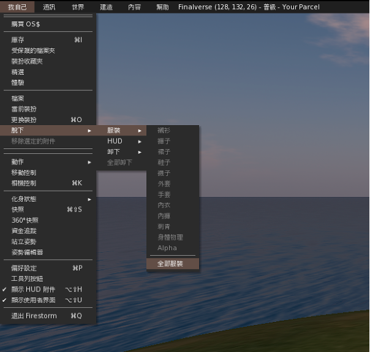
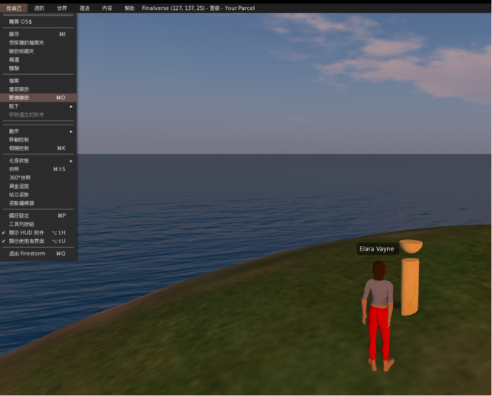
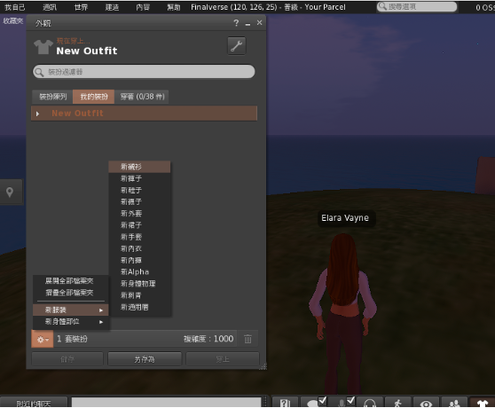
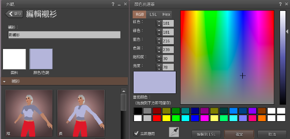
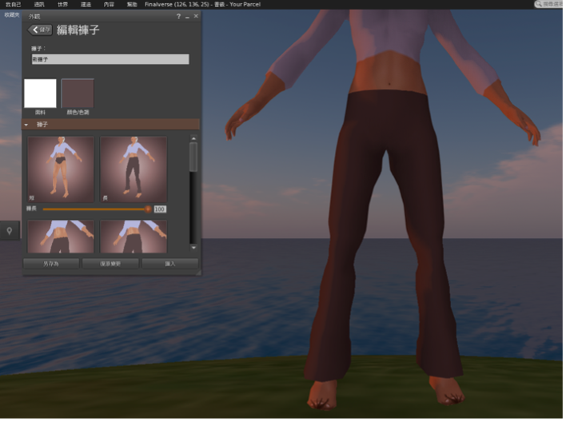
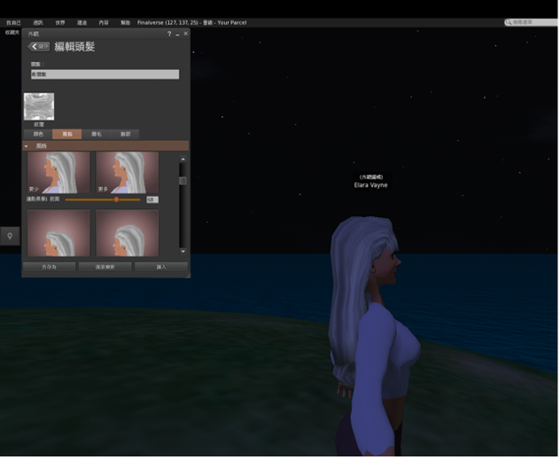
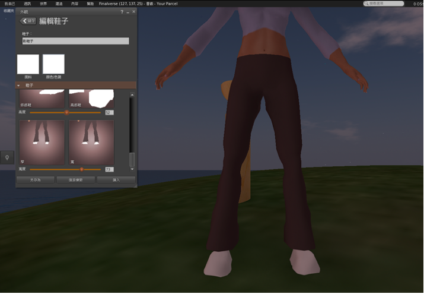
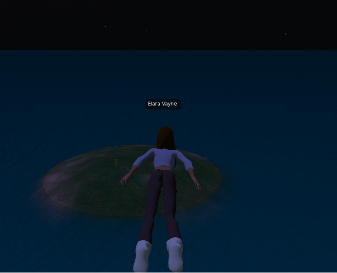

# Change Your Appearance and Clothes

1. First of all, we should take off all our outfits so that we don't mix and match.

2. Click on **myself** in the top left corner and find **Change Outfit**.

3. Tap on **New Outfit**.

4. Edit:
   - Shirts
   - Pants
   - Shoes
   - Change hair appearance

5. Controls:
   - Long press the `E` key to fly
   - Press the `F` key to fall
   - Use `WASD` keys to control direction  
   So you can fly in your world!

